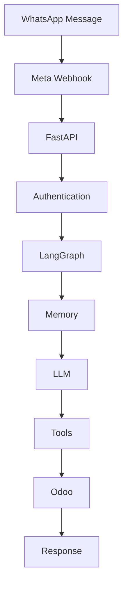
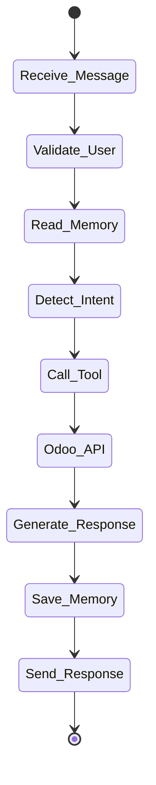
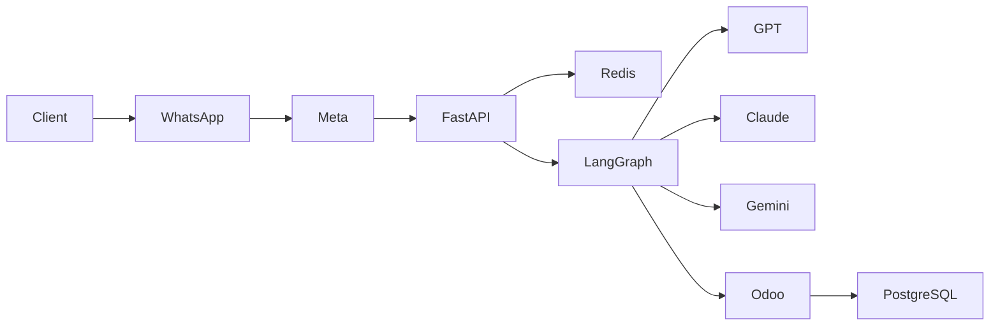

# 🚀 Odoo 19 AI Agent
## REST API • JSON-RPC • LangGraph • Redis Checkpointer • FastAPI • Meta WhatsApp Cloud API


---

# Enterprise AI Agent for Odoo 19

Production-ready AI Agent architecture for **Odoo 19 Enterprise** integrating:

- REST API
- JSON-RPC
- FastAPI
- LangGraph
- Redis Checkpointer
- Meta WhatsApp Cloud API
- Messenger
- Instagram
- OpenAI GPT
- Anthropic Claude
- Google Gemini

Designed for enterprise deployments requiring scalable conversational AI connected directly to ERP data.

---
# odoo-19-ai-agent-rest-api-json-rpc-langgraph-fastapi-meta-webhook
Odoo 19 AI Agent | REST API, JSON-RPC, LangGraph, Redis Checkpointer, FastAPI &amp; Meta Webhooks
# Main Features

✅ Long-Term Memory using Redis
✅ Multi-Agent Architecture (LangGraph)
✅ Odoo JSON-RPC Connector
✅ Odoo REST API
✅ AI Sales Assistant
✅ CRM Automation
✅ Inventory Assistant
✅ Purchase Orders
✅ Accounting Assistant
✅ Human Handoff
✅ Prompt Guardrails
✅ Hallucination Detection
✅ Audit Logs
✅ OAuth Authentication
✅ JWT Security
✅ Multi-company Support

---

# System Architecture

```text

                        +------------------------+
                        | WhatsApp Cloud API     |
                        +-----------+------------+
                                    |
                                    |
                           Meta Webhook
                                    |
                                    ▼
                    +-----------------------------+
                    |        FastAPI Server       |
                    +--------------+--------------+
                                   |
                     Authentication & Validation
                                   |
                                   ▼
                     +---------------------------+
                     |      LangGraph Agent      |
                     +------------+--------------+
                                  |
         +------------------------+----------------------+
         |                        |                      |
         ▼                        ▼                      ▼
 Memory Node             Reasoning Node          Tools Router
         |                        |                      |
         |                        |                      |
         ▼                        ▼                      ▼
 Redis Checkpointer      GPT / Claude / Gemini     Odoo APIs
                                                      |
                           +--------------------------+----------------+
                           |                                           |
                           ▼                                           ▼
                     REST API                                  JSON-RPC API
                           |                                           |
                           +--------------------------+----------------+
                                                      |
                                                      ▼
                                             Odoo 19 Enterprise
```

---

# Complete Architecture

```text

User

↓

WhatsApp

↓

Meta Cloud API

↓

FastAPI

↓

Authentication

↓

LangGraph

├── Intent Detection

├── Context Memory

├── Decision Node

├── AI Reasoning

├── Tool Selection

└── Response Generator

↓

Redis Memory

↓

Odoo Connector

├── CRM

├── Sales

├── Inventory

├── Purchase

├── Accounting

├── HR

└── Manufacturing

↓

JSON-RPC / REST API

↓

Odoo Database

```

---

# AI Workflow



---

# LangGraph State Diagram



---

# Deployment Diagram



---

# Enterprise Modules

| Module | AI Enabled |
|---------|------------|
| CRM | ✅ |
| Sales | ✅ |
| Inventory | ✅ |
| Accounting | ✅ |
| Manufacturing | ✅ |
| HR | ✅ |
| Purchase | ✅ |
| Helpdesk | ✅ |
| Marketing | ✅ |

---

# Technology Stack

| Component | Technology |
|------------|-----------|
| Backend | FastAPI |
| AI Framework | LangGraph |
| LLM | GPT / Claude / Gemini |
| ERP | Odoo 19 Enterprise |
| Memory | Redis Checkpointer |
| Database | PostgreSQL |
| Cache | Redis |
| Authentication | OAuth2 + JWT |
| Deployment | Docker |
| Reverse Proxy | Nginx |

---

# Estimated Project Cost

| Component | Estimated Cost |
|------------|----------------|
| Odoo Configuration | $5,000 – $10,000 |
| FastAPI Backend | $6,000 – $12,000 |
| LangGraph Development | $10,000 – $25,000 |
| QA & Security | $4,000 – $8,000 |
| Documentation & Training | $2,000 – $5,000 |
| **Total Project** | **$27,000 – $60,000 USD** |

---

# Estimated Timeline

| Phase | Duration |
|---------|----------|
| Architecture Design | 2 Weeks |
| FastAPI Development | 4 Weeks |
| LangGraph Agent | 4 Weeks |
| Meta Integration | 3 Weeks |
| QA & Deployment | 3 Weeks |

Total:

**8–16 Weeks**

---

# Commercial Licensing

This project is distributed under a **Dual Licensing Model**.

## Open Source License

AGPL v3

Ideal for:

- Community
- Research
- Personal Projects

---

## Commercial License

Enterprise customers may acquire a commercial license that allows:

- Closed-source deployments
- Proprietary modifications
- Private support
- Enterprise SLA
- Custom integrations
- Professional implementation

For enterprise licensing contact:

📧 armaterra@outlook.es

---

# Enterprise Services

We provide professional implementation services including:

- Odoo 19 Enterprise
- AI Agent Development
- LangGraph Consulting
- FastAPI Development
- WhatsApp Cloud API
- Meta Business Integration
- Redis Architecture
- API Development
- Prompt Engineering
- AI Security
- Training
- Maintenance

Enterprise Contact

📧 armaterra@outlook.es

---

# Keywords

Odoo AI

Odoo 19

LangGraph

FastAPI

REST API

JSON-RPC

ERP AI

WhatsApp AI

Meta Webhook

OpenAI

Claude

Gemini

Redis Checkpointer

Enterprise AI

AI ERP

CRM AI

Inventory AI

Accounting AI

Python AI
